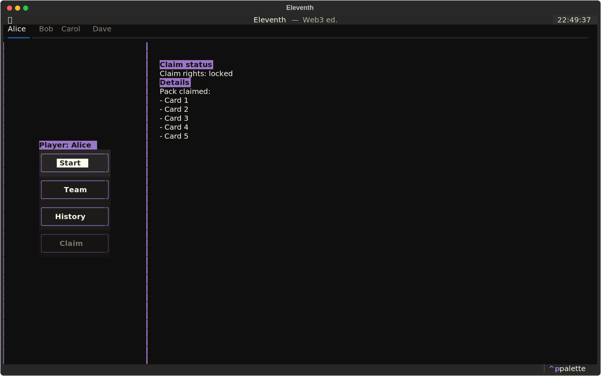

<h1 align="center">W3 Eleventh</h1>

<p align="center">⚽ <em>Only 11 wins</em> 🃏</p>

<p align="center">
    
</p>

**Eleventh** is a turn-based card game inspired by FIFA’s Ultimate Team cards and the strategic style of Soccer Manager.
Players build their own dream team using collectible cards, manage tactics, and compete in tactical duels against other managers. 

## At A Glance



<small align="center">Eleventh's demo menu screenshot</small>

## Notice

This is the 3rd version of this project and a direct continuation of the 2nd one, [World Cup](https://github.com/RickBarretto/WorldCup/).

Since the architecture changed a lot and I decided to only keep what is necessary for this problem, I decided to not mess up tags and instead create a new repository, so my professors can evaluate my work better.


## PBL Context

This project was developed for the subject TEC502 – Concurrency & Connectivity, which is taught using a Problem-Based Learning (PBL) approach.

In PBL, students work in groups to solve open-ended problems, progressing step by step through research, discussion, and implementation. This project in specific is individual, but sessions are organized in group to share experiences and brainstorming.

## Architecture

This PBL works as a Proof of Concept and should not be considered a complete or real-usage system. This uses a blockchain technology, via Etherium VM, to ensure correctness of storage and game rules.

Vyper Smart Contracts can be found on the folder `smart/` and this is tested under `test/` folder. Notice the folder `feature/` that describes all the behavior my application must have. The tests uses the philosophy of Behavioral-Driven Development (BDD), to describe what is expected to happen.

Also, there is `app`, that is a demo of this project and how this would look like in real-life. Since using a real blockchain is expensive, I decided to run it on testing-environment instead.

`app` much like simulates how this should work, but no need of network connection or some metamask integration, neither connecting to a real ETH blockchain.

Some particularities of this approach is that I can't have multiples instance of the client, obviously... So, I created a way to switch between users inside the same instance.

## Running it


### Install mise

See [Installing Mise](https://mise.jdx.dev/installing-mise.html) for more details.

### Install Mise's dependencies

On this root directory, run:

```sh
§ mise install
```

### Install Python Project's dependency

```sh
§ uv sync
```

### Run Demo

```sh
§ mise run demo
```

Or...

```sh
§ uv run -m app
```

### Run Tests

**Manually**

```sh
§ mise run test
```

or...

```sh
§ uv run pytest
```

**Via VsCode Integration**

Click on the **_Testing_** tab, then **_Run Tests_** button:


<small align="center">Make sure you've installed the Python extension from recommendation.</small>
